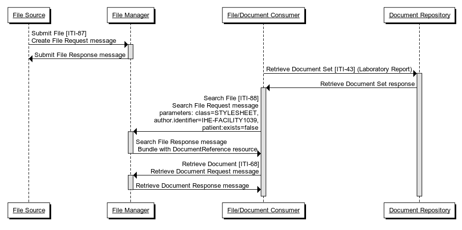
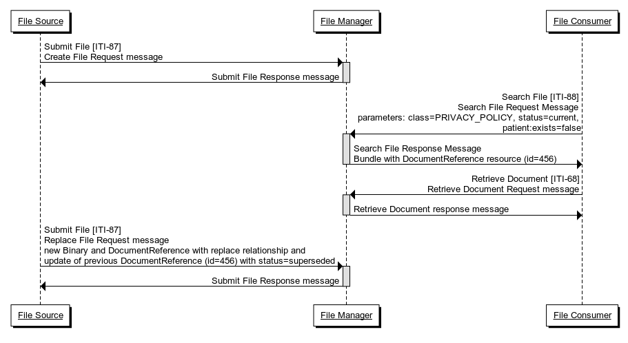
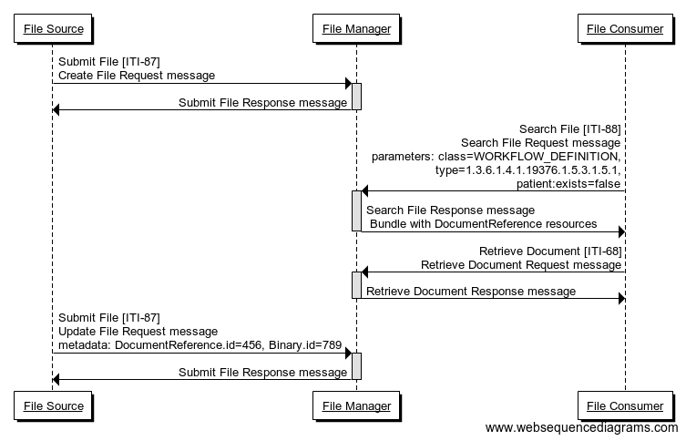
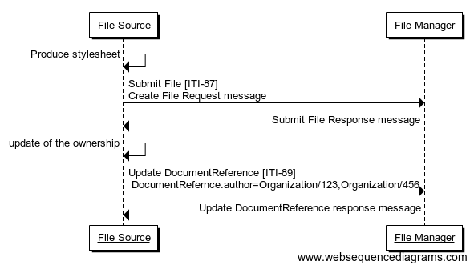

**Integrating the Healthcare Enterprise**

**IHE IT Infrastructure**

**Technical Framework Supplement**

**Non-patient File Sharing**

**(NPFS)**

HL7® FHIR® R4

Using Resources at FMM Level 3 and Normative

**Rev. 2.1 – Trial Implementation**

Date: December 5, 2019

Author: ITI Technical Committee

Email: iti@ihe.net

**Please verify you have the most recent version of this document.** See
[here](http://ihe.net/Technical_Frameworks/) for Trial Implementation
and Final Text versions and [here](http://ihe.net/Public_Comment/) for
Public Comment versions.

**Foreword**

This is a supplement to the IHE IT Infrastructure Technical Framework
V16.0. Each supplement undergoes a process of public comment and trial
implementation before being incorporated into the volumes of the
Technical Frameworks.

This supplement is published on December 5, 2019 for trial
implementation and may be available for testing at subsequent IHE
Connectathons. The supplement may be amended based on the results of
testing. Following successful testing it will be incorporated into the
IT Infrastructure Technical Framework. Comments are invited and may be
submitted at
[http://www.ihe.net/ITI_Public_Comments](http://www.ihe.net/ITI_Public_Comments/).

This supplement describes changes to the existing technical framework
documents.

“Boxed” instructions like the sample below indicate to the Volume Editor
how to integrate the relevant section(s) into the relevant Technical
Framework volume.

Amend Section X.X by the following:

Where the amendment adds text, make the added text **<u>bold
underline</u>**. Where the amendment removes text, make the removed text
**~~bold strikethrough~~**. When entire new sections are added,
introduce with editor’s instructions to “add new text” or similar, which
for readability are not bolded or underlined.

General information about IHE can be found at
[http://ihe.net](http://ihe.net/).

Information about the IHE IT Infrastructure domain can be found at
[http://ihe.net/IHE_Domains](http://ihe.net/IHE_Domains/).

Information about the organization of IHE Technical Frameworks and
Supplements and the process used to create them can be found at
[http://ihe.net/IHE_Process](http://ihe.net/IHE_Process/) and
[http://ihe.net/Profiles](http://ihe.net/Profiles/).

The current version of the IHE IT Infrastructure Technical Framework can
be found at
[http://ihe.net/Technical_Frameworks](http://ihe.net/Technical_Frameworks/).

CONTENTS

[Introduction to this Supplement
[6](#introduction-to-this-supplement)](#introduction-to-this-supplement)

[Open Issues and Questions
[7](#open-issues-and-questions)](#open-issues-and-questions)

[Closed Issues [7](#closed-issues)](#closed-issues)

[General Introduction
[10](#general-introduction)](#general-introduction)

[Appendix A – Actor Summary Definitions
[10](#appendix-a-actor-summary-definitions)](#appendix-a-actor-summary-definitions)

[Appendix B – Transaction Summary Definitions
[10](#appendix-b-transaction-summary-definitions)](#appendix-b-transaction-summary-definitions)

[Glossary [10](#glossary)](#glossary)

[**Volume 1 – Profiles [11](#_Toc26370145)**](#_Toc26370145)

[Copyright Licenses [11](#copyright-licenses)](#copyright-licenses)

[Domain-specific additions
[11](#domain-specific-additions)](#domain-specific-additions)

[47 Non-Patient File Sharing (NPFS) Profile
[12](#non-patient-file-sharing-npfs-profile)](#non-patient-file-sharing-npfs-profile)

[47.1 NPFS Actors, Transactions, and Content Modules
[12](#npfs-actors-transactions-and-content-modules)](#npfs-actors-transactions-and-content-modules)

[47.1.1 Actor Descriptions and Actor Profile Requirements
[13](#actor-descriptions-and-actor-profile-requirements)](#actor-descriptions-and-actor-profile-requirements)

[47.1.1.1 File Manager [14](#file-manager)](#file-manager)

[47.1.1.2 File Consumer [14](#file-consumer)](#file-consumer)

[47.1.1.3 File Source [14](#file-source)](#file-source)

[47.2 NPFS Actor Options [14](#npfs-actor-options)](#npfs-actor-options)

[47.2.1 File Retrieve Option
[14](#file-retrieve-option)](#file-retrieve-option)

[47.2.2 Update File Metadata Option
[14](#update-file-metadata-option)](#update-file-metadata-option)

[47.3 NPFS Required Actor Groupings
[15](#npfs-required-actor-groupings)](#npfs-required-actor-groupings)

[47.4 NPFS Overview [15](#npfs-overview)](#npfs-overview)

[47.4.1 Concepts – distinguishing files from documents
[15](#concepts-distinguishing-files-from-documents)](#concepts-distinguishing-files-from-documents)

[47.4.2 Use Cases [15](#use-cases)](#use-cases)

[47.4.2.1 Use Case \#1: Manage Stylesheets
[15](#use-case-1-manage-stylesheets)](#use-case-1-manage-stylesheets)

[47.4.2.1.1 Manage Stylesheets - Use Case Description
[15](#manage-stylesheets---use-case-description)](#manage-stylesheets---use-case-description)

[47.4.2.1.2 Stylesheet’s Management Process Flow
[16](#stylesheets-management-process-flow)](#stylesheets-management-process-flow)

[47.4.2.2 Use Case \#2: Replace Privacy Policies
[17](#use-case-2-replace-privacy-policies)](#use-case-2-replace-privacy-policies)

[47.4.2.2.1 Replace Privacy Policies - Use Case Description
[17](#replace-privacy-policies---use-case-description)](#replace-privacy-policies---use-case-description)

[47.4.2.2.2 Privacy Domain Policies Process Flow
[18](#privacy-domain-policies-process-flow)](#privacy-domain-policies-process-flow)

[47.4.2.3 Use Case \#3: Manage change to Workflow Definitions
[19](#use-case-3-manage-change-to-workflow-definitions)](#use-case-3-manage-change-to-workflow-definitions)

[47.4.2.3.1 Manage change to Workflow Definitions - Use Case Description
[19](#manage-change-to-workflow-definitions---use-case-description)](#manage-change-to-workflow-definitions---use-case-description)

[47.4.2.3.2 Workflow Definitions Process Flow
[19](#workflow-definitions-process-flow)](#workflow-definitions-process-flow)

[47.4.2.4 Use Case \#4: Update of file’s ownership
[21](#use-case-4-update-of-files-ownership)](#use-case-4-update-of-files-ownership)

[47.4.2.4.1 Update of file’s ownership - Use Case Description
[21](#update-of-files-ownership---use-case-description)](#update-of-files-ownership---use-case-description)

[47.4.2.4.2 Update of file’s ownership Process Flow
[22](#update-of-files-ownership-process-flow)](#update-of-files-ownership-process-flow)

[47.5 NPFS Security Considerations
[23](#npfs-security-considerations)](#npfs-security-considerations)

[47.6 NPFS Cross Profile Considerations
[23](#npfs-cross-profile-considerations)](#npfs-cross-profile-considerations)

[**Volume 2c – Transactions (cont.)
[24](#_Toc336000611)**](#_Toc336000611)

[3.87 Submit File \[ITI-87\]
[24](#submit-file-iti-87)](#submit-file-iti-87)

[3.87.1 Scope [24](#scope)](#scope)

[3.87.2 Actor Roles [24](#actor-roles)](#actor-roles)

[3.87.3 Referenced Standards
[24](#referenced-standards)](#referenced-standards)

[3.87.4 Messages [24](#messages)](#messages)

[3.87.4.1 Create File Request Message
[25](#create-file-request-message)](#create-file-request-message)

[3.87.4.1.1 Trigger Events [25](#trigger-events)](#trigger-events)

[3.87.4.1.2 Message Semantics
[25](#message-semantics)](#message-semantics)

[3.87.4.1.2.1 category element
[27](#category-element)](#category-element)

[3.87.4.1.2.2 type element [28](#type-element)](#type-element)

[3.87.4.1.2.3 File relationships
[28](#file-relationships)](#file-relationships)

[3.87.4.1.2.4 MasterIdentifier element
[28](#masteridentifier-element)](#masteridentifier-element)

[3.87.4.1.2.5 Create File request message example
[28](#create-file-request-message-example)](#create-file-request-message-example)

[3.87.4.1.3 Expected Actions [30](#expected-actions)](#expected-actions)

[3.87.4.2 Update File Request Message
[30](#update-file-request-message)](#update-file-request-message)

[3.87.4.2.1 Trigger Events [30](#trigger-events-1)](#trigger-events-1)

[3.87.4.2.2 Message Semantics
[30](#message-semantics-1)](#message-semantics-1)

[3.87.4.2.2.1 Update File Request message example
[31](#update-file-request-message-example)](#update-file-request-message-example)

[3.87.4.2.3 Expected Actions
[32](#expected-actions-1)](#expected-actions-1)

[3.87.4.3 Replace File Request Message
[32](#replace-file-request-message)](#replace-file-request-message)

[3.87.4.3.1 Trigger Events [32](#trigger-events-2)](#trigger-events-2)

[3.87.4.3.2 Message Semantics
[33](#message-semantics-2)](#message-semantics-2)

[3.87.4.3.3 Expected Actions
[33](#expected-actions-2)](#expected-actions-2)

[3.87.4.4 Submit File Response Message
[33](#submit-file-response-message)](#submit-file-response-message)

[3.87.4.4.1 Trigger Events [33](#trigger-events-3)](#trigger-events-3)

[3.87.4.4.2 Message Semantics
[34](#message-semantics-3)](#message-semantics-3)

[3.87.4.4.2.1 Submit File Response message example
[34](#submit-file-response-message-example)](#submit-file-response-message-example)

[3.87.4.4.3 Expected Actions
[35](#expected-actions-3)](#expected-actions-3)

[3.87.5 Security Considerations
[35](#security-considerations)](#security-considerations)

[3.87.5.1 Security Audit Considerations
[35](#security-audit-considerations)](#security-audit-considerations)

[3.88 Search File \[ITI-88\]
[35](#search-file-iti-88)](#search-file-iti-88)

[3.88.1 Scope [35](#scope-1)](#scope-1)

[3.88.2 Actor Roles [35](#actor-roles-1)](#actor-roles-1)

[3.88.3 Referenced Standards
[36](#referenced-standards-1)](#referenced-standards-1)

[3.88.4 Messages [36](#messages-1)](#messages-1)

[3.88.4.1 Search File Request Message
[36](#search-file-request-message)](#search-file-request-message)

[3.88.4.1.1 Trigger Events [36](#trigger-events-4)](#trigger-events-4)

[3.88.4.1.2 Message Semantics
[36](#message-semantics-4)](#message-semantics-4)

[3.88.4.1.2.1 Query Search Parameters
[37](#query-search-parameters)](#query-search-parameters)

[3.88.4.1.2.2 Populating Expected Response Format
[38](#populating-expected-response-format)](#populating-expected-response-format)

[3.88.4.1.3 Expected Actions
[38](#expected-actions-4)](#expected-actions-4)

[3.88.4.2 Search File Response Message
[38](#search-file-response-message)](#search-file-response-message)

[3.88.4.2.1 Trigger Events [38](#trigger-events-5)](#trigger-events-5)

[3.88.4.2.2 Message Semantics
[38](#message-semantics-5)](#message-semantics-5)

[3.88.4.2.3 Expected Actions
[39](#expected-actions-5)](#expected-actions-5)

[3.88.5 Security Considerations
[39](#security-considerations-1)](#security-considerations-1)

[3.88.5.1 Security Audit Considerations
[39](#security-audit-considerations-1)](#security-audit-considerations-1)

[3.89 Update DocumentReference \[ITI-89\]
[39](#update-documentreference-iti-89)](#update-documentreference-iti-89)

[3.89.1 Scope [39](#scope-2)](#scope-2)

[3.89.2 Actor Roles [39](#actor-roles-2)](#actor-roles-2)

[3.89.3 Referenced Standards
[40](#referenced-standards-2)](#referenced-standards-2)

[3.89.4 Messages [40](#messages-2)](#messages-2)

[3.89.4.1 Update DocumentReference Request Message
[40](#update-documentreference-request-message)](#update-documentreference-request-message)

[3.89.4.1.1 Trigger Events [40](#trigger-events-6)](#trigger-events-6)

[3.89.4.1.2 Message Semantics
[40](#message-semantics-6)](#message-semantics-6)

[3.89.4.1.2.1 Update DocumentReference Request message example
[41](#update-documentreference-request-message-example)](#update-documentreference-request-message-example)

[3.89.4.1.3 Expected Actions
[42](#expected-actions-6)](#expected-actions-6)

[3.89.4.2 Update DocumentReference Response Message
[42](#update-documentreference-response-message)](#update-documentreference-response-message)

[3.89.4.2.1 Trigger Events [43](#trigger-events-7)](#trigger-events-7)

[3.89.4.2.2 Message Semantics
[43](#message-semantics-7)](#message-semantics-7)

[3.89.4.2.3 Expected Actions
[43](#expected-actions-7)](#expected-actions-7)

[3.89.5 Security Considerations
[43](#security-considerations-2)](#security-considerations-2)

[3.89.5.1 Security Audit Considerations
[43](#security-audit-considerations-2)](#security-audit-considerations-2)

[**Volume 2c – Transactions (cont.)
[44](#_Toc480817710)**](#_Toc480817710)

[3.68.2 Use Case Roles [44](#use-case-roles)](#use-case-roles)

#  Introduction to this Supplement

<table>
<colgroup>
<col style="width: 100%" />
</colgroup>
<thead>
<tr class="header">
<th>
Whenever possible, IHE profiles are based on established and
stable underlying standards. However, if an IHE domain determines that
an emerging standard has high likelihood of industry adoption, and the
standard offers significant benefits for the use cases it is attempting
to address, the domain may develop IHE profiles based on such a
standard. During Trial Implementation, the IHE domain will update and
republish the IHE profile as the underlying standard evolves.

Product implementations and site deployments may need to be updated
in order for them to remain interoperable and conformant with an updated
IHE profile.

This NPFS Profile is based on Release 4 of the emerging
HL7®<a href="#fn1" class="footnote-ref" id="fnref1"
role="doc-noteref">1</a> FHIR®<a href="#fn2"
class="footnote-ref" id="fnref2" role="doc-noteref">2</a>
standard. HL7 describes FHIR Change Management and Versioning at <a
href="https://www.hl7.org/fhir/versions.html">https://www.hl7.org/fhir/versions.html</a>.

HL7 provides a rating of the maturity of FHIR content based on the
FHIR Maturity Model (FMM): level 0 (draft) through N (Normative). See <a
href="http://hl7.org/fhir/versions.html#maturity">http://hl7.org/fhir/versions.html#maturity</a>.

The FMM levels for FHIR content used in this profile are:

<table>
<colgroup>
<col style="width: 68%" />
<col style="width: 31%" />
</colgroup>
<thead>
<tr class="header">
<th>FHIR Resource Name</th>
<th>FMM Level</th>
</tr>
</thead>
<tbody>
<tr class="odd">
<td>DocumentReference</td>
<td>3</td>
</tr>
<tr class="even">
<td>Bundle</td>
<td>N</td>
</tr>
<tr class="odd">
<td>Binary</td>
<td>N</td>
</tr>
<tr class="even">
<td>OperationOutcome</td>
<td>N</td>
</tr>
</tbody>
</table></th>
</tr>
</thead>
<tbody>
</tbody>
</table>
<section id="footnotes" class="footnotes footnotes-end-of-document"
role="doc-endnotes">

<ol>
<li id="fn1">
HL7 is the registered trademark of Health Level Seven
International.<a href="#fnref1" class="footnote-back"
role="doc-backlink">↩︎</a>
</li>
<li id="fn2">
FHIR is the registered trademark of Health Level Seven
International.<a href="#fnref2" class="footnote-back"
role="doc-backlink">↩︎</a>
</li>
</ol>
</section>

This profile defines how to enable the sharing of non-patient files.

Those files can be created, consumed and updated by many different
systems involved in a wide variety of data sharing workflows (clinical
workflow definition, domain policies sharing, stylesheets management,
etc.). This profile identifies three actors: File Manager, File
Consumer, and File Source. To fulfill use-case requirements, this
profile defines three new transactions (Submit File \[ITI-87\], Search
File \[ITI-88\], and Update DocumentReference \[ITI-89\]) and re-uses an
MHD transaction: Retrieve Document \[ITI-68\].

There are IHE profiles that define the content of files that are not
patient-related; this profile does not require that the actors be able
to process the contents of the files being shared. Understanding this
profile does not require the knowledge of the files shared.

The NPFS Profile specifies transactions for the sharing of files. Any
file type can be shared using this profile; however, specific guidance
is given for three types of files:

- Workflow Definitions: files which define the processing rules for a
  specific clinical/administrative workflow (see ITI TF-1: 30.4.1.1 “XDW
  Workflow Architecture” for additional information).

- Privacy Domain Policies: files which describe a specific privacy
  policy that applies to, or may be agreed by the patient (see ITI TF-1:
  19.2 “Creating Patient Privacy Policies” for further details).

- Stylesheets: structured documents used by user-agents (e.g., Web
  Browsers) to render the content of an XML document.

Local policies may extend the types of files shared using NPFS and that
can be classified using the metadata model described in this profile.

## Open Issues and Questions

***NPFS_010: This document begins the definition of a value set for the
class element. How do we complete the value set for this profile.
Suggestions are requested. How do we coordinate this value set with
other Document Sharing profiles? Suggestions are requested. ***

***NPFS_012: This document does not require the use of profile tags to
identify compliant resources. Use of profile tags will also allow the
File Consumer to search just for resources that matches this profile in
a FHIR Server that store different types of resources. Readers are
required to provide feedback on this topic.***

## Closed Issues

***NPFS_001: This supplement does not define metadata elements identify
or classify targets for the publication of the file (e.g., intended
recipients or classes of recipients). Readers are asked to provide
feedback on whether this is needed. Should the profile cover the
requirements to identify targets with both identifiers and classes
(e.g., This “document is intended for user 12345,” or “this document is
intended for GPs.”)?***

- *We choose to not address this issue because the use of the
  context.related.ref could open the user to reference any type of
  resource also ones with patient information in it*

***NPFS_002: Confirm the scope, because as requests were received to
cover other documents, in particular, public health report. We are going
to draft three use-cases: Policy Documents, Workflow Definitions,
stylesheets.***

- *This supplement targets specific use cases selected as representative
  of wider classes of use. Feedback on non-patient document sharing uses
  not addressed through the supplement is requested.*

***NPFS_003: What are the metadata that can be used to classify those
files?***

- *ftp://ftp.ihe.net/IT_Infrastructure/iheitiyr15-2017-2018/Technical_Cmte/Workitems/Non-Patient%20Document%20Sharing%20(NPDS)/NPFS%20-%20Technical%20Needs.xlsx*

- *periodValidity metadata: Should it have mandatory start, but optional
  end elements?*

*This issue could be addressed valuating the context.period.start and
context.period.end element of the DocumentReference Resource.*

- *interestedPartiesIdentification metadata has to be a code or an
  identifier?*

This use-case has not been addressed. Check OI NPFS_001

- *Should we let the status metadata be modified by the File Manager
  such we had the most recent status in order to accomplish the release
  management?*

*The Update DocumentReference transaction has been added to fulfill this
issue*

***NPFS_004: How can I know if there is an updated version of the file
or my file is deprecated?***

- *Using a specific metadata, it is possible to search, through the
  replacement association, the latest version of the file. The status of
  the replaced file needs to be changed by the File Source with the
  Update DocumentReference transaction.*

***NPFS_005: FHIR STU3 doesn’t support the "mime-type" search parameter
for the DocumentReference Resource. How can we search for mime-types?***

- *The use-case for which this issue was opened no longer exists. So the
  File Consumer can search for the format of the file and that is
  sufficient.*

***NPFS_006: This version of NPFS supplement define three new actors and
three new transactions. Readers during PC period are asked to provide
feedback on this topic. and transaction names needs to be changed?***

*No particular feedback received during PC, so the committee decided to
maintain the names defined.*

***NPFS_007: We will follow the FHIR approach, should we align this
work-item with MHD? (Option in MHD…)***

- *Keep them separate for many reasons. Although we’ve decided to
  profile the Document Reference Resource, there are some different
  requirements. It is more safe to keep the two work-items separate for
  security requirements and decrease the implementation effort on server
  side.*

***NPFS_008: Is the word “document” the right one? Should we speak about
“Files”?***

- *This profile introduces the concept of “File” in order to mark a
  clear separation with DS\* profiles defined by IHE IT Infrastructure
  domain. A “File” represents a collection of information from the web
  that is stored on a computer as one unit under one specific name. IHE
  IT Infrastructure domain has already defined a suite of profiles aimed
  to share (using different sharing paradigms) documents related to
  patients, so another characteristic of a file (as it is described in
  this profile) is to be non-patient related.*

***NPFS_009: Should we address the Consume process as a fetch?***

- *This profile defines the usage of two distinct transaction to consume
  the file, because in one of our use-case the consumer could just be
  interested to retrieve DocumentReference Resource and not the file
  itself.*

***NPFS_011: Which is the right standard to use?***

- *For this profile, we had a standard selection process between several
  healthcare standards, such FHIR and infoButton, and non-healthcare
  standards such NPI storage and OData. The selection was made starting
  from which metadata shall be addressed by the standard and by IHE
  implementers efforts. The result of this selection was HL7 FHIR. See
  <ftp://ftp.ihe.net/IT_Infrastructure/iheitiyr15-2017-2018/Technical_Cmte/Workitems/Non-Patient%20Document%20Sharing%20(NPDS)/NPFS%20-%20Technical%20Needs.xlsx>.*

# General Introduction

Update the following Appendices to the General Introduction as indicated
below. Note that these are not appendices to Volume 1.

# Appendix A – Actor Summary Definitions

Add the following actors to the IHE Technical Frameworks General
Introduction list of actors:

| Actor         | Definition                                                                                                                                                                                                                                                        |
|---------------|-------------------------------------------------------------------------------------------------------------------------------------------------------------------------------------------------------------------------------------------------------------------|
| File Manager  | This actor stores files provided by the File Source and maintains related metadata. The File Manager responds to search and retrieve requests initiated by the File Consumer. The File Manager responds to metadata update requests initiated by the File Source. |
| File Source   | The File Source publishes and updates files produced by either the File Source or by other systems. It is responsible for sending files and related metadata to a File Manager.                                                                                   |
| File Consumer | The File Consumer queries a File Manager for file metadata meeting certain criteria, and may retrieve selected files.                                                                                                                                             |

# Appendix B – Transaction Summary Definitions

Add the following transactions to the IHE Technical Frameworks General
Introduction list of transactions:

| transaction                         | Definition                                                                                                              |
|-------------------------------------|-------------------------------------------------------------------------------------------------------------------------|
| Submit File \[ITI-87\]              | This transaction allows a File Source to publish a file and related metadata, or to update or replace an existing file. |
| Search File \[ITI-88\]              | This transaction allows a File Consumer to query for a file metadata that meets certain criteria                        |
| Update DocumentReference \[ITI-89\] | This transaction allows a File Source to update file metadata.                                                          |

# Glossary

Add the following glossary terms to the IHE Technical Frameworks General
Introduction Glossary:

No new glossary terms.

Volume 1 – Profiles

## Copyright Licenses

Add the following to the IHE Technical Frameworks General Introduction
Copyright section:

NA

## Domain-specific additions

NA

Add Section 47

# 47 Non-Patient File Sharing (NPFS) Profile

The Non-Patient File Sharing Profile defines how to enable sharing of
non-patient files such as clinical workflow definitions, domain
policies, and stylesheets. Those files can be created and consumed by
many different systems involved in a wide variety of data sharing
workflows.

The NPFS Profile describes a mechanism for sharing non-patient files; it
does not require that the actors be able to process the contents of the
files being shared.

The NPFS Profile specifies transactions for the sharing of files. Any
file type can be shared using this profile; however, specific guidance
is given for three types of files:

- Workflow Definitions: files which define the processing rules for a
  specific clinical/administrative workflow (see ITI TF-1: 30.4.1.1 “XDW
  Workflow Architecture”)

- Privacy Domain Policies: files which describe a specific privacy
  policy that applies to, or may be agreed to, by a patient (see ITI
  TF-1: 19.2 “Creating Patient Privacy Policies”)

- Stylesheets: structured documents that can be used by user-agents
  (e.g., Web Browsers) to render the content of an XML document.

Local policies may extend the types of files that are being shared using
NPFS and that can be classified using the metadata model described in
this profile.

## 47.1 NPFS Actors, Transactions, and Content Modules

This section defines the actors, transactions, and/or content modules in
this profile. General definitions of actors are given in the Technical
Frameworks General Introduction Appendix A at
<https://www.ihe.net/resources/technical_frameworks/#GenIntro>.

Figure 47.1-1 shows the actors directly involved in NPFS Profile and the
relevant transactions between them. If needed for context, other actors
that may be indirectly involved due to their participation in other
related profiles are shown in dotted lines. Actors which have a
mandatory grouping are shown in conjoined boxes.

Figure 47.1-1: NPFS Actor Diagram

Table 47.1-1 lists the transactions for each actor directly involved in
the NPFS Profile. To claim compliance with this profile, an actor shall
support all required transactions (labeled “R”) and may support the
optional transactions (labeled “O”).

Table 47.1-1: NPFS Profile - Actors and transactions

| Actors        | Transactions                        | Optionality | Reference              |
|---------------|-------------------------------------|-------------|------------------------|
| File Manager  | Submit File \[ITI-87\]              | R           | ITI TF-2c: 3.87        |
|               | Search File \[ITI-88\]              | R           | ITI TF-2c: 3.88        |
|               | Retrieve Document \[ITI-68\]        | R           | ITI TF-2c: 3.68 (Note) |
|               | Update DocumentReference \[ITI-89\] | R           | ITI TF-2c: 3.89        |
| File Consumer | Search File \[ITI-88\]              | R           | ITI TF-2c: 3.88        |
|               | Retrieve Document \[ITI-68\]        | O           | ITI TF-2c: 3.68 (Note) |
| File Source   | Submit File \[ITI-87\]              | R           | ITI TF-2c: 3.87        |
|               | Update DocumentReference \[ITI-89\] | O           | ITI TF-2c: 3.89        |

Note: This transaction is currently specified in the MHD Trial
Implementation Supplement.

### 47.1.1 Actor Descriptions and Actor Profile Requirements

Most requirements are documented in transactions (Volume 2) and Content
Modules (Volume 3). This section documents any additional requirements
on profile’s actors.

#### 47.1.1.1 File Manager

The File Manager stores files provided by the File Source and maintains
related metadata. The File Manager responds to search and retrieve
requests initiated by the File Consumer. The File Manager responds to
metadata update requests initiated by the File Source.

#### 47.1.1.2 File Consumer 

The File Consumer queries for file metadata meeting certain criteria,
and may retrieve selected files.

#### 47.1.1.3 File Source 

The File Source publishes and updates files produced by either the File
Source or by other systems. It is responsible for sending files and
related metadata to a File Manager. The File Source can send metadata
update requests to the File Manager.

## 47.2 NPFS Actor Options

Options that may be selected for each actor in this profile, if any, are
listed in Table 47.2-1. Dependencies between options when applicable are
specified in notes.

Table 47.2-1: Not-patient File Sharing - Actors and Options

| Actor         | Option Name          | Reference      |
|---------------|----------------------|----------------|
| File Manager  | No options defined   | --             |
| File Consumer | File Retrieve        | Section 47.2.1 |
| File Source   | Update File Metadata | Section 47.2.2 |

### 47.2.1 File Retrieve Option

The File Retrieve Option enables a File Consumer to retrieve a file
stored/managed by the File Manager.

A File Consumer that supports the File Retrieve Option shall support the
Retrieve Document \[ITI-68\] transaction.

### 47.2.2 Update File Metadata Option

The Update File Metadata Option enables a File Source to update the
metadata of a file stored/managed by the File Manager.

A File Source that supports the Update File Metadata Option shall
support the Update DocumentReference \[ITI-89\] transaction.

## 47.3 NPFS Required Actor Groupings 

This profile does not mandate the grouping with other actors.

## 47.4 NPFS Overview

### 47.4.1 Concepts – distinguishing files from documents

The NPFS Profile uses the term “**file**” to mark a clear distinction
from the IHE Document Sharing profiles.

A “**file**” represents a collection of information stored on a computer
as one unit. For the purposes of this profile, a file is not
patient-related, as it does not contain patient health identifying
information. It may contain other sensitive information.

Other IHE profiles are used to share (using different sharing paradigms)
information related to patients. In IHE terminology, such
patient-specific content is a “**document**.”

### 47.4.2 Use Cases

#### 47.4.2.1 Use Case \#1: Manage Stylesheets

A technician creates a stylesheet to render the XML of
CDA®[^1] Laboratory Reports produced in all the Laboratory
Information System (LIS) involved in the Healthcare Information Exchange
(HIE). The technician wants to make the stylesheet available to all the
LISs involved in the HIE so that they can search for the stylesheet and
reference it as an XSL transformation of the Laboratory Report.

##### 47.4.2.1.1 Manage Stylesheets - Use Case Description

A Healthcare Organization desires to use a stylesheet for uniform
rendering of XML Laboratory Reports produced within the organization.
Mr. Black, a technician of the Healthcare Organization, creates the
stylesheet. Then Mr. Black uses his File Source to publish the
stylesheet file into a system that manages non-patient files (File
Manager) using the Submit File \[ITI-87\] transaction. Now the
stylesheet will be available to all the LISs involved in the
organization.

A Laboratory Information System, according to the HIE policy, should be
able to identify the stylesheet that can be used to render the CDA
document.

Mrs. White uses the LIS to retrieve a patient’s CDA R2 Lab Report
document from the HIE. The LIS also issues a query using the Search File
\[ITI-88\] transaction, to search for a stylesheet file published by the
HIE Organization, in order to discover the resource URL of the
stylesheet applicable to the Laboratory Reports. This URL is used to
reference it as an XSL transformation of the Laboratory Report.

##### 47.4.2.1.2 Stylesheet’s Management Process Flow

- The Health Information System acting as a File Source issues a Submit
  File \[ITI-87\] transaction to the File Manager to submit the
  stylesheet

- The LIS acting as a File Consumer issues a Search File \[ITI-88\]
  transaction to the File Manager, using the class parameter to search
  for stylesheets, and the author.identifier parameter to search for the
  organization that submitted the file. The query response contains the
  URL of the stylesheet, that will be retrieved using a Retrieve
  Document \[ITI-68\] transaction.

Figure 47.4.2.1.2-1: Basic Process Flow in NPFS Profile for Stylesheets
management

The text in Figure 47.4.2.1.2-2 was used to generate the diagram in
Figure 47.4.2.1.2-1. Readers will generally find the diagram more
informative. The text is included here to facilitate editing.

<table>
<colgroup>
<col style="width: 100%" />
</colgroup>
<thead>
<tr class="header">
<th>
File Source-&gt;+File Manager: Submit File [ITI-87]\nCreate File
Request message

File Manager-&gt;-File Source: Submit File Response message

File/Document Consumer-&gt;+Document Repository: Retrieve Document
Set [ITI-43] (Laboratory Report)

Document Repository-&gt;+File/Document Consumer: Retrieve Document
Set response

File/Document Consumer-&gt;+File Manager: Search File
[ITI-88]\nSearch File Request message\nparameters:
class=STYLESHEET,\nauthor.identifier=IHE-FACILITY1039,\npatient:exists=false

File Manager-&gt;-File/Document Consumer:Search File Response
message\n Bundle with DocumentReference resource

File/Document Consumer-&gt;+File Manager: Retrieve Document
[ITI-68]\nRetrieve Document Request message

File Manager-&gt;-File/Document Consumer:Retrieve Document Response
message
</th>
</tr>
</thead>
<tbody>
</tbody>
</table>

Figure 47.4.2.1.2-2: Pseudocode for Process Flow Diagram

#### 47.4.2.2 Use Case \#2: Replace Privacy Policies 

In this use case, the hospital’s privacy office creates files that
describe the Privacy Policies that the patient can agree to. When a
patient is admitted, the admitting nurse uses a NPFS File Consumer to
search the File Manager for the current Privacy Policy files available.

Then, when the patient selects a Privacy Policy, the nurse uses a Basic
Patient Privacy Consent (BPPC) Content Creator Actor (see ITI TF-1: 19)
to create the patient’s Privacy Policy Consent document for the patient.

##### 47.4.2.2.1 Replace Privacy Policies - Use Case Description

A hospital’s privacy office defines a set of Privacy Policies that a
patient can agree to. Mr. Blue, a hospital privacy office employee,
creates a Privacy Policy file using the HIS. Using a Submit File
\[ITI-87\] transaction, the application makes the file available to all
the systems involved in his organization.

Mrs. Black, a nurse of the Goodcare Hospital, wants to search for the
current valid Privacy Policy files that the admitting patient can agree
to. She uses a combined BPPC Content Creator and NPFS File Consumer to
issue a query, a Search File \[ITI-88\] transaction, to search for the
current valid Privacy Policy files and retrieve them. One of the
retrieved Privacy Policy files is used, by the BPPC Content Creator, to
create the Privacy Policy Consent document that the patient can read and
agree to.

Later, a legal health officer informs the Goodcare Hospital that one of
the Privacy Policies has changed. Mr. Blue searches to discover the
Privacy Policy file and its related metadata (including FHIR resource
ids). He thus needs to replace the Privacy Policy file and uses an HIS
to perform the Submit File \[ITI-87\] to replace the Privacy Policy by
submitting a new one (linked to the original file via a replacement
association, using the relatesTo parameter) and updating metadata for
the previous Privacy Policy, changing its status to “superseded”.

This use case is different than Use Case \#3 because here the original
Privacy Policy file needs to be preserved (i.e., it is not overwritten).

##### 47.4.2.2.2 Privacy Domain Policies Process Flow

- The Health Information System, acting as a File Source, issues a
  Submit File \[ITI-87\] (create) transaction to the File Manager to
  submit the original Privacy Policy file and metadata.

- The HIS, acting as a File Consumer, issues a Search File \[ITI-88\]
  transaction to the File Manager. The File Consumer uses the class
  parameter and the status parameter to search for the metadata (i.e.,
  DocumentReference Resources) for current Privacy Policy files. Once
  the DocumentReference Resource is found, the File Consumer issues a
  Retrieve Document \[ITI-68\] transaction to the File Manager to
  retrieve the file.

- The HIS, acting as a File Source, issues a Submit File \[ITI-87\]
  (replace) transaction to the File Manager to submit the new Privacy
  Policy file and metadata, and update the metadata of the replaced file
  to “superseded” (deprecated). (The new DocumentReference Resource is
  linked to the previous one via a replacement relationship, using the
  relatesTo parameter; see ITI TF-2c: 3.87.4.3.2.)

Figure 47.4.2.2.2-1: Basic Process Flow in NPFS Profile for Privacy
Policies management

The text in Figure 47.4.2.2.2-2 was used to generate the diagram in
Figure 47.4.2.2.2-1. Readers will generally find the diagram more
informative. The text is included here to facilitate editing.

<table>
<colgroup>
<col style="width: 100%" />
</colgroup>
<thead>
<tr class="header">
<th>
File Source-&gt;+File Manager: Submit File [ITI-87]\nCreate File
Request message

File Manager-&gt;-File Source: Submit File Response message

File Consumer-&gt;+File Manager: Search File [ITI-88]\nSearch File
Request Message\nparameters: class=PRIVACY_POLICY, status=current,\n
patient:exists=false

File Manager-&gt;-File Consumer: Search File Response Message\nBundle
with DocumentReference resource (id=456)

File Consumer-&gt;+File Manager: Retrieve Document [ITI-68]\nRetrieve
Document Request message

File Manager-&gt;-File Consumer: Retrieve Document response
message

File Source-&gt;+File Manager: Submit File [ITI-87]\nReplace File
Request message\nnew Binary and DocumentReference with replace
association and\nupdate of previous DocumentReference (id=456) with
status=superseded

File Manager-&gt;-File Source: Submit File Response message
</th>
</tr>
</thead>
<tbody>
</tbody>
</table>

Figure 47.4.2.2.2-1: Pseudocode for Process Flow Diagram

#### 47.4.2.3 Use Case \#3: Manage change to Workflow Definitions 

A technician at Goodcare Hospital uses the Hospital Information System
to create and later update a BPMN (“Business Process Model and
Notation;” see <http://www.bpmn.org/>) Workflow Definition file to
design an eReferral Process. This file is published using a File Source.
Later, a specialist who does not regularly work with Goodcare Hospital
can access this Workflow Definition to review the workflow steps before
referring a patient.

##### 47.4.2.3.1 Manage change to Workflow Definitions - Use Case Description

An HIE decides to design the eReferral Process for all the participants
involved in that workflow. Mr. Smith, a technician at Goodcare Hospital,
records the process in a BPMN Workflow Definition file, and makes it
available using the Submit File \[ITI-87\] transaction.

Dr. Jones, a specialist, uses her HIS to query for the BPMN Workflow
Definition file produced by Goodcare Hospital related to eReferral
workflow, using a Search File \[ITI-88\] transaction. The previously
submitted Workflow Definition file is found and retrieved, and Dr. Jones
can identify the next steps in the eReferral process.

Later the HIE decides that the Workflow Definition file submitted is no
longer valid and wants to use a new Workflow Definition file, so it
updates the previous file using the Submit File \[ITI-87\] transaction.

This use case is different than Use Case \#2 because here the original
Workflow Definition file does not need to be preserved so it is, in
effect, overwritten.

##### 47.4.2.3.2 Workflow Definitions Process Flow

- The Health Information System acting as a File Source issues a Submit
  File \[ITI-87\] (create) transaction to the File Manager to submit the
  original Workflow Definition file.

- Later, to find the Workflow Definition in order to update it, the HIS
  acting as a File Consumer issues a Search File \[ITI-88\] transaction
  to the File Manage. The File Consumer uses the class parameter and the
  type parameter to search for Workflow Definitions related to eReferral
  workflow. Once the Document Reference Resource is found, the HIS
  issues a Retrieve Document \[ITI-68\] transaction to the File Manager
  to retrieve it.

- The Health Information System, acting as a File Source, issues a
  Submit File \[ITI-87\] (update) to the File Manager to make available
  the newer Workflow Definition file and metadata (updating the previous
  resources on the File Manager).

Figure 47.4.2.3.2-1: Basic Process Flow in NPFS Profile for Workflow
Definition Documents management

The text in Figure 47.4.2.3.2-2 was used to generate the diagram in
Figure 47.4.2.3.2-1. Readers will generally find the diagram more
informative. The text is included here to facilitate editing.

<table>
<colgroup>
<col style="width: 100%" />
</colgroup>
<thead>
<tr class="header">
<th>
File Source-&gt;+File Manager: Submit File [ITI-87]\nCreate File
Request message

File Manager-&gt;-File Source: Submit File Response message

File Consumer-&gt;+File Manager: Search File [ITI-88]\nSearch File
Request message\nparameters:
class=WORKFLOW_DEFINITION,\ntype=1.3.6.1.4.1.19376.1.5.3.1.5.1,\npatient:exists=false

File Manager-&gt;-File Consumer:Search File Response message\n Bundle
with DocumentReference resources

File Consumer-&gt;+File Manager: Retrieve Document [ITI-68]\nRetrieve
Document Request message

File Manager-&gt;-File Consumer:Retrieve Document Response
message

File Source-&gt;+File Manager: Submit File [ITI-87]\nUpdate File
Request message\nmetadata: DocumentReference.id=456, Binary.id=789

File Manager-&gt;-File Source: Submit File Response messageFile
Source-&gt;+File Manager: Submit File [ITI-87]\nCreate File Request
message

File Manager-&gt;-File Source: Submit File Response message

File Consumer-&gt;+File Manager: Search File [ITI-88]\nSearch File
Request message\nparameters:
class=WORKFLOW_DEFINITION,\ntype=1.3.6.1.4.1.19376.1.5.3.1.5.1,\npatient:exists=false

File Manager-&gt;-File Consumer:Search File Response message\n Bundle
with DocumentReference resources

File Consumer-&gt;+File Manager: Retrieve Document [ITI-68]\nRetrieve
Document Request message

File Manager-&gt;-File Consumer:Retrieve Document Response
message

File Source-&gt;+File Manager: Submit File [ITI-87]\nCreate File
Request message

File Manager-&gt;-File Source: Submit File Response message

File Consumer-&gt;+File Manager: Search File [ITI-88]\nSearch File
Request message\nparameters:
class=WORKFLOW_DEFINITION,\ntype=1.3.6.1.4.1.19376.1.5.3.1.5.1,\npatient:exists=false

File Manager-&gt;-File Consumer:Search File Response message\n Bundle
with DocumentReference resource

File Source-&gt;+File Manager: Update DocumentReference
[ITI-89]\nUpdate DocumentReference Request message\nmetadata:
DocumentReference.id=1234,\nDocumentReference.status=superseded

File Manager-&gt;-File Source: Update DocumentReference Response
message
</th>
</tr>
</thead>
<tbody>
</tbody>
</table>

Figure 47.4.2.3.2-2: Pseudocode for Process Flow Diagram

#### 47.4.2.4 Use Case \#4: Update of file’s ownership 

A technician creates a stylesheet to render the XML documents produced
by document producers belonging to Hospital Hope. After some time, the
same stylesheet also needs to be made accessible to Hospital Peace. In
order to accomplish this task, the technician updates metadata that
describe the file in order to extend the ownership also to Hospital
Peace.

##### 47.4.2.4.1 Update of file’s ownership - Use Case Description

Hospital Hope desires uniform rendering of XML documents produced within
the organization, so it creates a stylesheet file. Mr. Black, a
technician of the Hospital Hope, creates the stylesheet. Then Mr. Black
uses his File Source to publish the stylesheet file into a system that
manages non-patient files (File Manager) using the Submit File
\[ITI-87\] transaction. Now the stylesheet will be available to document
producers belonging to Hospital Hope. According to the local policies,
the technician needs to extend the ownership of this file also to
Hospital Peace. In order to do that, Mr. Black executes an update of the
DocumentReference associated with the stylesheet using the Update
DocumentReference \[ITI-89\] transaction. Now the stylesheet’s
DocumentReference reflects the ownership of Hospital Hope and Hospital
Peace.

##### 47.4.2.4.2 Update of file’s ownership Process Flow

- The Health Information System acting as a File Source issues a Submit
  File \[ITI-87\] (create) transaction to the File Manager to submit the
  stylesheet

- The Health Information System acting as a File Source issues an Update
  DocumentReference \[ITI-89\] transaction to the File Manager to modify
  the DocumentReference.author list.

Figure 47.4.2.4.2-1: Basic Process Flow in NPFS Profile for Update of
file’s ownership

The text in Figure 47.4.2.4.2-2 was used to generate the diagram in
Figure 47.4.2.4.2-1. Readers will generally find the diagram more
informative. The text is included here to facilitate editing.

<table>
<colgroup>
<col style="width: 100%" />
</colgroup>
<thead>
<tr class="header">
<th>
File Source-&gt;File Source: Produce stylesheet

File Source-&gt;File Manager: Submit File [ITI-87]\nCreate File
Request message

File Manager-&gt;File Source: Submit File Response message

File Source-&gt;File Source: update of the ownership

File Source-&gt;File Manager: Update DocumentReference [ITI-89]\n
DocumentRefernce.author=Organization/123,Organization/456

File Manager-&gt;File Source: Update DocumentReference response
message
</th>
</tr>
</thead>
<tbody>
</tbody>
</table>

## 47.5 NPFS Security Considerations

Non-patient files do not contain Patient Health Information (PHI), but
they may contain other sensitive information such as physician reviews,
work schedules, etc. In addition, those files can be used in conjunction
with patient-related documents in order to satisfy clinical data
consuming/sharing workflows. The reader should know that mistakes will
be made, and these files may convey private information.

Although this profile does not require actors to audit the transactions
that exchange non-patient files, grouping with an ATNA Secure Node or
Secure Application is strongly encouraged in order to track file and
metadata creation and update.

User authentication/authorization represents another important factor to
consider in order to avoid malicious creation/updating of files.
Grouping NPFS actors with actors in the Internet User Authorization
(IUA) Profile enables deployments to mitigate these security issues.

## 47.6 NPFS Cross Profile Considerations

None.

Volume 2c – Transactions
(cont.)

Add Section 3.87 – 3.89

## 3.87 Submit File \[ITI-87\]

### 3.87.1 Scope

This transaction allows a File Source to publish a new file and related
metadata. It also enables update of an existing file and update its
metadata and replacement of a file.

The files are not associated with a patient.

### 3.87.2 Actor Roles

Table 3.87.2-1: Actor Roles

| **Actor:** | File Source                                                      |
|------------|------------------------------------------------------------------|
| **Role:**  | Sends non-patient files and related metadata to a File Manager.  |
| **Actor:** | File Manager                                                     |
| **Role:**  | Stores received non-patient files and maintains related metadata |

### 3.87.3 Referenced Standards

| HL7 FHIR | HL7 FHIR R4 <http://hl7.org/fhir/R4/index.html> |
|----------|-------------------------------------------------|

### 3.87.4 Messages

Figure 3.87.4-1: Interaction Diagram

#### 3.87.4.1 Create File Request Message

The File Source uses this message to submit a new file (Binary Resource)
and related metadata (DocumentReference Resource) to a target File
Manager using a FHIR transaction.

##### 3.87.4.1.1 Trigger Events

The File Source needs to submit a new file to a File Manager. The file
may have been created by the File Source itself or by another file
creator.

##### 3.87.4.1.2 Message Semantics

The File Source shall issue an HTTP request according to requirements
defined in the HL7® FHIR® standard for “create”
interaction (<http://hl7.org/fhir/R4/http.html#create> ). The message
uses an HTTP POST method to submit a FHIR Bundle Resource.

The Bundle Resource:

- shall contain one Binary Resource
  (<https://www.hl7.org/fhir/R4/binary.html>) representing the file. The
  Binary Resource shall contain the base64-encoded file in the content
  element and the mime-type of the file in the contentType element.

- shall contain one FHIR DocumentReference Resource
  (<https://www.hl7.org/fhir/R4/documentreference.html)> with the file’s
  metadata. Constraints on the DocumentReference Resource are listed in
  Table 3.87.4.1.2-1.

- may contain other resources that are referenced by the
  DocumentReference Resource.

The File Source shall submit FHIR resources in either XML format or JSON
format. Values for media-type of the request message are defined in the
ITI TF-2x: Appendix Z.6 (currently in the Appendix Z on HL7 FHIR Trial
Implementation Supplement)*.*

Table 3.87.4.1.2-1: DocumentReference Resource Constraints

<table>
<colgroup>
<col style="width: 34%" />
<col style="width: 38%" />
<col style="width: 27%" />
</colgroup>
<thead>
<tr class="header">
<th>Element Name</th>
<th>IHE Constraint</th>
<th>Notes</th>
</tr>
</thead>
<tbody>
<tr class="odd">
<td>
id

[0..1]
</td>
<td></td>
<td>The id element shall be provided if the File Source is sending a
Replace File Message Section 3.87.4.2.2). The value is the id of the
DocumentReference Resource to be updated.</td>
</tr>
<tr class="even">
<td>
masterIdentifier

[0..1]
</td>
<td></td>
<td>See Section 3.87.4.1.2.4.</td>
</tr>
<tr class="odd">
<td>
status

[1..1]
</td>
<td></td>
<td></td>
</tr>
<tr class="even">
<td>
type

[0..1]
</td>
<td>[1..1]</td>
<td>See Section 3.87.4.1.2.2.</td>
</tr>
<tr class="odd">
<td>
category

[0..1]
</td>
<td>[1..1]</td>
<td>File’s class (e.g., Workflow Definition, Stylesheet, Privacy
Policy). See Section 3.87.4.1.2.1.</td>
</tr>
<tr class="even">
<td>
subject

[0..1]
</td>
<td>[0..0]</td>
<td></td>
</tr>
<tr class="odd">
<td>
date

[0..1]
</td>
<td>[1..1]</td>
<td>Time when the file was submitted.</td>
</tr>
<tr class="even">
<td>
author

[0..*]
</td>
<td>[1..*]</td>
<td>The author element shall be valued with at least a reference to an
Organization Resource.</td>
</tr>
<tr class="odd">
<td>
relatesTo

[0..*]
</td>
<td></td>
<td>See Section 3.87.4.1.2.3.</td>
</tr>
<tr class="even">
<td>
content.attachment.contentType

[0..1]
</td>
<td>[1..1]</td>
<td></td>
</tr>
<tr class="odd">
<td>
content.attachment.language

[0..1]
</td>
<td>Required if known</td>
<td></td>
</tr>
<tr class="even">
<td>
content.attachment.data

[0..1]
</td>
<td>[0..0]</td>
<td></td>
</tr>
<tr class="odd">
<td>
content.attachment.url

[0..1]
</td>
<td>[1..1]</td>
<td>
For new submitted files this element shall be valued with the
same opaque identifier of the entry.fullurl related to the Binary
Resource.

For updates to files this element shall be valued with the URL of the
Binary Resource that can be used to retrieve the file using the Retrieve
Document [ITI-68] transaction.
</td>
</tr>
<tr class="even">
<td>
content.attachment.size

[0..1]
</td>
<td>[1..1]</td>
<td></td>
</tr>
<tr class="odd">
<td>
content.attachment.hash

[0..1]
</td>
<td>[1..1]</td>
<td></td>
</tr>
<tr class="even">
<td>
content.format

[0..1]
</td>
<td>[1..1]</td>
<td>File’s format. The values of this metadata should be defined by
local domain policies.</td>
</tr>
<tr class="odd">
<td>
context.sourcePatientInfo

[0..1]
</td>
<td>[0..0]</td>
<td></td>
</tr>
<tr class="even">
<td>
context.encounter

[0..*]
</td>
<td>[0..0]</td>
<td></td>
</tr>
<tr class="odd">
<td>
context.related

[0..*]
</td>
<td>[0..0]</td>
<td></td>
</tr>
</tbody>
</table>

See ITI TF-2x: Appendix W for informative implementation material for
this transaction.

Sections below provide specific guidance about how handle metadata for
stylesheets, workflow definitions, and privacy policies. If other files
types will be managed, local policy should establish values for type,
category, format, mime-type and masterIdentifier elements.

###### 3.87.4.1.2.1 category element

Codes in the category element shall be from Table 3.87.4.1.2.1-1, if any
of the codes within the value set can apply to the concept being
communicated. If the table does not cover the concept (based on human
review), an alternate code may be used instead.

Table 3.87.4.1.2.1-1: Coded values the category element

| coding.code         | coding.display                                | coding.system                     |
|---------------------|-----------------------------------------------|-----------------------------------|
| STYLESHEET          | Code for Stylesheets                          | urn:ihe:iti:npfs:2017:class-codes |
| WORKFLOW_DEFINITION | Code for Workflow Definitions                 | urn:ihe:iti:npfs:2017:class-codes |
| 57017-6             | Code for Privacy policy Organization Document | http://www.loinc.org              |

###### 3.87.4.1.2.2 type element

This section identifies specific guidelines for the type element which
depends on the “class” of the file:

- If the file submitted is a Workflow Definition template, the type
  element could be valued with the workflow definition reference of the
  Workflow Definition profile (see workflowDefinitionReference as
  defined by the XDW Profile; see ITI TF-3: 5.4.2.2).

- If the file submitted is a Patient Privacy Policy (see ITI TF-1:
  19.2.1 Basic Patient Privacy Consent), the type element should be
  valued with the LOINC code 57017-6 “Privacy policy Organization
  Document” as shown in Table 3.87.4.1.2.1-1 .

- If the file submitted is a Stylesheet, the type element will be valued
  with a codeable concept defined by local policy that classifies the
  type of the stylesheet. The codeable concept of the type element shall
  be defined by both a code and a system (e.g., code= “laboratory”
  system=”http://localdomain.org/stylesheetstype”).

###### 3.87.4.1.2.3 File relationships 

The relatesTo element holds relationships that the file has with other
non-patient files. The DocumentReference.relatesTo element allows for
the creation of those relationships (i.e., replacement, sign, transform,
or append).

###### 3.87.4.1.2.4 MasterIdentifier element

This section identifies specific requirements for the masterIdentifier
element, if used:

- If the file submitted is a Workflow Definition template, the
  masterIdentifier element shall be valued with the
  workflowDefinitionReference as defined by the XDW Profile (see ITI
  TF-3: 5.4.2.2).

- If the file submitted is a Patient Privacy Policy (see ITI TF-1:
  19.2.1 Basic Patient Privacy Consent),, the masterIdentifier element
  shall be valued with the associated Patient Privacy Policy Identifier.

Local policies should define how to handle this element in case of
file’s revision, update or replacement.

###### 3.87.4.1.2.5 Create File request message example

An example of a Create File Request Bundle is presented below.

<table>
<colgroup>
<col style="width: 100%" />
</colgroup>
<thead>
<tr class="header">
<th><mark>{ 
"resourceType": "Bundle", 
"type": "transaction", 
"entry": [ 
{ 
"resource": { 
"resourceType": "DocumentReference", 
"status": "current", 
"type": {"coding": [{ 
"code": "urn:oid:1.3.6.1.4.1.19376.1.5.3.1.5.1", 
"display": "eReferral workflow " 
}]}, 
"category": {"coding": [{ 
"system": "urn:ihe:iti:npfs:2017:class-codes", 
"code": "WORKFLOW_DEFINITION" 
}]}, 
"date": "2017-04-17T11:00:00", 
"author": [{"reference":
"urn:uuid:9f146027-bbab-467e-b8f7-5b695c4c6891"}], 
"content": [{ 
"attachment": { 
"contentType": "application/pdf", 
"language": "en-US", 
"url": "urn:uuid:d3e62cb3-7be5-4971-a765-471669688f33", 
"size": "3456", 
"hash":
"07ae8b27c7596b3314601736f32d5f0ed17fc8c0e27a0475e8ea2d8b2c788436" 
}, 
"format": [{"code": "application/pdf"}] 
}] 
}, 
"request": { 
"method": "POST", 
"url": "http://ihe-npfs.com/DocumentReference" 
} 
}, 
{ 
"fullUrl": "urn:uuid:d3e62cb3-7be5-4971-a765-471669688f33", 
"resource": { 
"resourceType": "Binary", 
"contentType": "application/pdf", 
"content":
"PD94bWwgdmVyc2ldHRwOi8vd3d3LncKPC9DbGluaWNhbERvY3VtZW50Pgo=" 
}, 
"request": { 
"method": "POST", 
"url": "http://ihe-npfs.com/Binary" 
} 
}, 
{ 
"fullUrl": "urn:uuid:9f146027-bbab-467e-b8f7-5b695c4c6891", 
"resource": { 
"resourceType": "Organization", 
"identifier": [{ 
"system": "urn:oid:1.12.234.56", 
"value": "IHE FACILITY1039" 
}] 
}, 
"request": { 
"method": "POST", 
"url": "http://ihe-npfs.com/Organization" 
} 
} 
] 
}</mark></th>
</tr>
</thead>
<tbody>
</tbody>
</table>

Figure 3.87.4.1.2.5-1: Create File Request example

##### 3.87.4.1.3 Expected Actions

The File Manager shall support all the media-types defined in ITI TF-2x:
Appendix Z.6 (currently in the Appendix Z on HL7 FHIR Trial
Implementation Supplement).

On receipt of the Create File Request, the File Manager shall validate
the Resources and respond with one of the HTTP codes defined in Section
3.87.4.4.2 Message Semantics.

The File Manager shall process the Bundle atomically.

The File Manager shall support Create File Request messages that contain
one Binary Resource and one DocumentReference Resource. The File Manager
shall store these resources and make them available for further
processing, e.g., file update or replacement \[ITI-87\], file metadata
update \[ITI-89\], search \[ITI-88\], and retrieve \[ITI-68\].

If the File Manager receives a Create File Request message that contains
resources other than the required ones, it may respond to the File
Source with a failure (see Section 3.87.4.4.2).

#### 3.87.4.2 Update File Request Message

The File Source uses this message to update a file already existing on
the File Manager.

This message is used when there is a prior file that does not need to be
preserved.

The File Manager is not required to support FHIR resource versioning
(<https://www.hl7.org/fhir/R4/versions.html>.)

##### 3.87.4.2.1 Trigger Events

The File Source needs to update a file that exists on the File Manager.

Prior to sending the update, the File Source shall discover the resource
ids of the existing DocumentReference Resource and the Binary Resource
to be updated.

##### 3.87.4.2.2 Message Semantics

The File Source shall issue an HTTP request according to requirements
defined in the HL7® FHIR® standard for “update”
interaction (<http://hl7.org/fhir/R4/http.html#update>).

The message uses an HTTP POST to submit a FHIR Bundle that contains the
updated Binary and DocumentReference Resources. For each resource in the
Bundle, the bundle.entry.request.method shall be valued with the HTTP
PUT Method.

The Bundle Resource shall contain:

- one Binary Resource (<https://www.hl7.org/fhir/R4/binary.html>)
  representing the file that will update the existing Binary Resource.
  The id of the Binary Resource shall be valued with the id of the
  Binary Resource to be updated on the File Manager.

- one DocumentReference Resource
  (<https://www.hl7.org/fhir/R4/documentreference.html>) with updated
  metadata. The id of the DocumentReference Resource shall be valued
  with the id of the DocumentReference Resource to be updated;
  constraints on the DocumentReference Resource are listed in Table
  3.87.4.1.2-1.

The File Source shall submit FHIR resources in either XML format or JSON
format. Values for media-type of the request message are defined in the
ITI TF-2x: Appendix Z.6 (currently in the Appendix Z on HL7 FHIR Trial
Implementation Supplement)*.*

###### 3.87.4.2.2.1 Update File Request message example

An example of a Replace File Request Bundle is presented below.

<table>
<colgroup>
<col style="width: 100%" />
</colgroup>
<thead>
<tr class="header">
<th>
<mark>{ 
"resourceType": "Bundle", 
"type": "transaction", 
"entry": [ 
{</mark>

<mark>"fullUrl": "http://ihe-npfs.com/DocumentReference/1234", 
"resource": { 
"resourceType": "DocumentReference",</mark>

<mark>"id": "1234", 
"status": "current", 
"type": {"coding": [{ 
"code": "1.3.6.1.4.1.19376.1.5.3.1.5. ", 
"display": "eReferral workflow " 
}]}, 
"category": {"coding": [{ 
"system": "urn:ihe:iti:npfs:2017:class-codes", 
"code": "WORKFLOW_DEFINITION" 
}]}, 
"date": "2017-04-17T11:00:00", 
"author": [{"reference": "
http://ihe-npfs.com/Organization/1564"}], 
"content": [{ 
"attachment": { 
"contentType": "application/pdf", 
"language": "en-US", 
"url": "http://ihe-npfs.com/Binary/1236", 
"size": "3456", 
"hash":
"07ae8b27c7596b3314601736f32d5f0ed17fc8c0e27a0475e8ea2d8b2c788436" 
}, 
"format": [{"code": "application/pdf"}] 
}] 
}, 
"request": { 
"method": "PUT", 
"url": "http://ihe-npfs.com/DocumentReference/1234" 
} 
}, 
{ 
"fullUrl": "http://ihe-npfs.com/Binary/1236", 
"resource": { 
"resourceType": "Binary",</mark>

<mark>"id": "1236", 
"contentType": "application/pdf", 
"content":
"PD94bWwgdmVyc2ldHRwOi8vd3d3LncKPC9DbGluaWNhbERvY3VtZW50Pgo=" 
}, 
"request": { 
"method": "PUT", 
"url": "http://ihe-npfs.com/Binary/1236" 
} 
} 
] 
}</mark>
</th>
</tr>
</thead>
<tbody>
</tbody>
</table>

Figure 3.87.4.2.2.1-1: Update File Request example

##### 3.87.4.2.3 Expected Actions

The File Manager shall support all the media-type defined in ITI TF-2x:
Appendix Z.6 (currently in the Appendix Z on HL7 FHIR Trial
Implementation Supplement).

On receipt of the Update File Request, the File Manager shall respond
with one of the HTTP codes defined in Section 3.87.4.4.2 Message
Semantics.

The File Manager shall process the Bundle atomically.

The File Manager shall support Update File Request messages that contain
one Binary Resource and one DocumentReference Resource. The File Manager
shall store these resources and make them available for further
processing, e.g., file update or replacement \[ITI-87\], file metadata
update \[ITI-89\], search \[ITI-88\], and retrieve \[ITI-68\]

The previous content in the updated Binary and DocumentReference
Resources will be no longer accessible, and the new file will be
retrievable using the same bundle.entry.fullUrl as the previous one.

If the File Manager receives an Update File Request message that
contains resources other than the required ones, it may respond to the
File Source with a failure (see Section 3.87.4.4.2).

#### 3.87.4.3 Replace File Request Message

The File Source uses this message to replace a file already existing on
the File Manager.

This message is used when there is a prior file that needs to be
preserved, so the existing Binary and Document Reference Resources will
be superseded (i.e., deprecated).

The File Manager is not required to support FHIR resource versioning
(<https://www.hl7.org/fhir/R4/versions.html>.)

##### 3.87.4.3.1 Trigger Events

The File Source needs to replace a file that exists on the File Manager.

The replace mechanism will be handled by creating a new file and
updating the previous DocumentReference Resource in one message.

##### 3.87.4.3.2 Message Semantics

This message uses an HTTP POST to submit a FHIR Bundle that contains the
new Binary and DocumentReference Resources and also the prior
DocumentReference Resource that needs to be replaced.

The Bundle Resource shall contain:

- one Binary Resource representing the new file, valued according to
  Section 3.87.4.1.2, with the bundle.entry.request.method element set
  to POST

- one DocumentReference Resource with metadata for the new file, where
  the DocumentReference.status shall be set to “current”, the
  relatesTo.code shall be set to “replaces”, and the relatesTo.target to
  the URL of the previous DocumentReference Resource, and the
  bundle.entry.request.method element set to POST

- one DocumentReference Resource with metadata of the previous file,
  valued as specified in Section 3.89.4.1.1 with the
  bundle.entry.request.method element set to PUT and the
  DocumentReference.status to “superseded”.

##### 3.87.4.3.3 Expected Actions

The File Manager shall support all the media-types defined in ITI TF-2x:
Appendix Z.6 (currently in the Appendix Z on HL7 FHIR Trial
Implementation Supplement).

On receipt of the Replace File Request, the File Manager shall validate
the Resources and respond with one of the HTTP codes defined in Section
3.87.4.4.2 Message Semantics.

The File Manager shall process the Bundle atomically.

The File Manager shall store these resources and make the new file
available for further processing, e.g., file update or replacement
\[ITI-87\], file metadata update \[ITI-89\], search \[ITI-88\], and
retrieve \[ITI-68\].

If the File Manager receives a Replace File Request message that
contains resources other than the required ones, it may respond to the
File Source with a failure (see Section 3.87.4.4.2).

#### 3.87.4.4 Submit File Response Message

The File Manager sends a Submit File Response message in response to a
Create File Request, an Update File Request, or a Replace File Request
Message.

##### 3.87.4.4.1 Trigger Events

When the File Manager has finished creating or updating the file and
metadata received from the File Source, the File Manager sends this
message to the File Source acknowledging the result of the create,
update or replace request.

##### 3.87.4.4.2 Message Semantics

When the File Manager has processed the request, it shall return an HTTP
response with an overall status code.

The File Manager returns a HTTP status code appropriate to the
processing, conforming to the transaction specification requirements as
specified in <http://hl7.org/fhir/R4/http.html#transaction-response>.

To allow the File Source to know the outcome of processing the
transaction, and the identities assigned to the resources by the File
Manager, the File Manager shall return a Bundle, with type set to
transaction-response, that contains one entry for each entry in the
request, in the same order as received, with the outcome of processing
the entry. Each entry element shall contain a response element with an
HTTP Status Code which details the outcome of processing of the request
entry.

If the operation is a success, the HTTP status code of the response
shall be a 2xx code.

If the operation is a failure, the File Manager shall be capable of
returning the following status code:

- 422 – Unprocessable Entity:

- When the FHIR Resource DocumentReference.type is not supported by the
  > File Manager.

- If the Bundle Resource contains resources other than Binary,
  > DocumentReference Resources and the resources referenced by the
  > DocumentReference Resource.

The File Manager can return other status codes 4xx or 5xx in accordance
to internal business rules that are out of scope for this transaction.

###### 3.87.4.4.2.1 Submit File Response message example 

<table>
<colgroup>
<col style="width: 100%" />
</colgroup>
<thead>
<tr class="header">
<th>
<mark>{ 
“resourceType”:”Bundle”, 
“type”:”transaction-response”, 
“entry”:[ 
{ 
“response”: 
{ 
“status”:”201”</mark>

<mark>“location”:”http://www.ihe.org/DocumentReference/453” 
} 
}, 
{ 
“response”: 
{ 
“status”:”201”</mark>

<mark>“location”:”http://www.ihe.org/Binary/123” 
} 
},</mark>

<mark>{ 
“response”: 
{ 
“status”:”201”</mark>

<mark>“location”:”http://www.ihe.org/Organization/789” 
} 
} 
] 
}</mark>
</th>
</tr>
</thead>
<tbody>
</tbody>
</table>

##### 3.87.4.4.3 Expected Actions

The File Source processes the response according to application-defined
rules.

### 3.87.5 Security Considerations

Actors involved in this transaction should be aware that even if the
Resources exchanged do not contain PHI or other private information,
actions such creating, updating, or replacing those Resources could
compromise patient care or have other legal ramifications. For general
security considerations, see ITI TF-2x: Appendix Z.8 (currently in the
Appendix Z on HL7 FHIR Trial Implementation Supplement).

#### 3.87.5.1 Security Audit Considerations

This transaction does not require the actors involved to send audit
messages to an Audit Record Repository because it does not convey PHI.
However, the auditing of the Submit File transaction is recommended in
order to avoid malicious creation/updating of files associated with the
care of the patient. The audit message for the Submit File transaction
shall comply with the structure defined in DICOM®[^2] PS3.15
Annex A.5.1.

## 3.88 Search File \[ITI-88\]

### 3.88.1 Scope

The transaction is used by the File Consumer to find DocumentReference
Resources that are stored and managed by a File Manager. The
DocumentReference Resources represent files that are not associated with
patient.

### 3.88.2 Actor Roles

Table 3.88.2-1: Actor Roles

| **Actor:** | File Consumer                                                                           |
|------------|-----------------------------------------------------------------------------------------|
| **Role:**  | Searches for a list of DocumentReference Resources based on a set of search parameters  |
| **Actor:** | File Manager                                                                            |
| **Role:**  | Returns a list of DocumentReference Resources that match the search parameters provided |

### 3.88.3 Referenced Standards

| HL7 FHIR | HL7 FHIR R4 <http://hl7.org/fhir/R4/index.html> |
|----------|-------------------------------------------------|

### 3.88.4 Messages

Figure 3.88.4-1: Interaction Diagram

#### 3.88.4.1 Search File Request Message

This message is a parametrized HTTP GET that allows a File Consumer to
search for a list of the FHIR DocumentReference Resources managed by the
File Manager, based on a set of search parameters.

##### 3.88.4.1.1 Trigger Events

A File Consumer sends this message to the File Manager when it needs to
discover DocumentReference Resources for non-patient-related files.

##### 3.88.4.1.2 Message Semantics

The File Consumer executes an HTTP GET against the File Manager. This
request shall comply with requirements specified in the HL7®
FHIR® standard <http://hl7.org/fhir/R4/http.html#search>.

The search target URL follows the FHIR HTTP specification, addressing
the DocumentReference Resource <http://hl7.org/fhir/R4/http.html>:

> \[base\]/DocumentReference?\[Parameters\]

The Parameters element represents a series of encoded name-value pairs
representing the filter for the query, as specified in Section
3.88.4.1.2.1, as well as control parameters to modify the behavior of
the File Manager such as response format, or pagination.

###### 3.88.4.1.2.1 Query Search Parameters

The File Consumer may supply and the File Manager shall support all the
query parameters listed below:

- **identifier**

This parameter, of type token, allows the File Consumer to search on the
logical identifier of the resource.

- **\_id**

  This parameter, of type token, allows the File Consumer to search on
  the logical id assigned to the resource.

- **patient**

This parameter shall always be used in this transaction to find
resources that do not have the patient element valued. To achieve that,
this parameter shall be used with the exists modifier (e.g.,
patient:exists=false).

The File Consumer shall not use the query parameter **subject** with a
reference to a Patient Resource.

- **date**

This parameter, of type date, specifies the time when the file, to which
the DocumentReference refers, was submitted. The File Consumer shall use
the date and interval mechanism described in HL7 FHIR
(<http://hl7.org/fhir/R4/search.html#date>) to indicate a specific date,
or a date that lies within the range specified by the parameter.

- **author.identifier**

This parameter, of type token, specifies the identifier of the author
that has submitted the file. See ITI TF-2x: Appendix Z.2.2 (currently in
the Appendix Z on HL7 FHIR Trial Implementation Supplement) for use of
the token data type.

- **format**

This parameter, of type token, specifies the file’s format.

- **language**

This parameter, of type token, specifies the language of the file.

- **location**

This parameter, of type uri, specifies the URI where the file can be
found.

- **status**

This parameter, of type token, specifies the status of the file.

- **relatesto**

This parameter, of type reference, specifies one or more existing
DocumentReference Resources that have been replaced by the submitted
DocumentReference Resource.

- **relation**

This parameter, of type token**,** specifies the type of relation that
the file being searched has with the targeted file specified in the
relatesTo parameter, see
<http://hl7.org/fhir/R4/valueset-document-relationship-type.html> for
the type of relation allowed.

- **relationship**

This parameter, of type composite, is the combination of the
**relatesTo** and **relation** search parameter.

###### 3.88.4.1.2.2 Populating Expected Response Format

See ITI TF-2x: Appendix Z.6 (currently in the Appendix Z on HL7 FHIR
Trial Implementation Supplement) for details.

##### 3.88.4.1.3 Expected Actions

The File Manager shall process the query to discover DocumentReference
Resources that are not associated to any patient and that match the
search parameters. The File Manager shall send a Search File Response
message containing matching results.

The File Manager may return DocumentReference Resources that are not
constrained as specified in Table 3.87.4.1.2-1.

#### 3.88.4.2 Search File Response Message

The File Manager returns a HTTP Status code appropriate to the
processing as well as a list of the matching DocumentReference
Resources.

##### 3.88.4.2.1 Trigger Events

The File Manager has completed the processing of the Search File Request
message.

##### 3.88.4.2.2 Message Semantics

Based on the query results, the File Manager shall either return an
error or success.

Guidance on handling Access Denied related to use of 200, 403 and 404
can be found in ITI TF- 2x: Appendix Z.7 (currently in the Appendix Z on
HL7 FHIR Trial Implementation Supplement).

When the File Manager needs to report an error, it shall use HTTP error
response codes and should include a FHIR OperationOutcome with more
details on the failure. See FHIR <http://hl7.org/fhir/R4/http.html> and
<http://hl7.org/fhir/R4/operationoutcome.html>.

If the Search File Request message is processed successfully, whether or
not any matching DocumentReference Resources are found, the HTTP status
code shall be 200. The Search File Response message shall be a Bundle
Resource containing zero or more DocumentReference Resources. If the
File Manager is responding with warnings, the Bundle Resource shall also
contain an OperationOutcome Resource that contains those warnings.

The response shall adhere to the FHIR Bundle constraints specified in
ITI TF-2x: Appendix Z.1 (currently in the Appendix Z on HL7 FHIR Trial
Implementation Supplement).

##### 3.88.4.2.3 Expected Actions

The File Consumer shall process the results according to
application-defined rules.

If a File Consumer cannot automatically recover from an error condition,
it should, at a minimum, display the error to the user.

### 3.88.5 Security Considerations

Actors involved in this transaction should be aware that even if the
Resources exchanged do not contain PHI or other private information,
exchange of those Resources could compromise patient care or have other
legal ramifications. For general security considerations, see ITI TF-2x:
Appendix Z.8 (currently in the Appendix Z on HL7 FHIR Trial
Implementation Supplement).

#### 3.88.5.1 Security Audit Considerations

This transaction does not require the actor involved to send audit
messages to an Audit Record Repository because does not convey PHI.
However, the auditing of the search operation is recommended in order
track unusual access to files. The audit message for the Search File
transaction shall comply with the structure defined in DICOM PS3.15
Annex A.5.1

## 3.89 Update DocumentReference \[ITI-89\]

### 3.89.1 Scope

This transaction allows a File Source to update a DocumentReference
Resource previously submitted. The DocumentReference Resource represents
metadata for a file that is not associated with a patient.

The File Manager is not required to support FHIR resource versioning
(see <https://www.hl7.org/fhir/R4/http.html#history>).

### 3.89.2 Actor Roles

Table 3.89.2-1: Actor Roles

| **Actor:** | File Source                                                |
|------------|------------------------------------------------------------|
| **Role:**  | Sends an update to an existing DocumentReference Resource. |
| **Actor:** | File Manager                                               |
| **Role:**  | Updates and maintains DocumentReference Resources.         |

### 3.89.3 Referenced Standards

| HL7 FHIR | HL7 FHIR R4 <http://hl7.org/fhir/R4/index.html> |
|----------|-------------------------------------------------|

### 3.89.4 Messages

Figure 3.89.4-1: Interaction Diagram

#### 3.89.4.1 Update DocumentReference Request Message

The File Source uses this message to update a FHIR DocumentReference
Resource already stored on the File Manager.

##### 3.89.4.1.1 Trigger Events

The File Source needs to update one DocumentReference Resource managed
in the File Manager.

Prior to sending the update, the File Source shall discover the id of
the existing DocumentReference Resource.

##### 3.89.4.1.2 Message Semantics

The File Source shall issue an HTTP request according to requirements
defined in HL7® FHIR® standard for “update”
interaction (<http://hl7.org/fhir/R4/http.html#update>).

The File Source shall use an HTTP PUT method to submit to the File
Manager a DocumentReference Resource. The DocumentReference Resource
conveys to the File Manager the update to a file’s metadata.

This message shall convey one DocumentReference Resource. The id of the
DocumentReference Resource shall be valued with the id of the
DocumentReference Resource to be updated; see Table 3.87.4.1.2-1 for
other constraints upon the DocumentReference Resource.

The File Source shall submit the DocumentReference Resource in either
XML format or JSON format. Values accepted for media-type of the request
message are defined in the ITI TF-2x: Appendix Z.6 (currently in the
Appendix Z on HL7 FHIR Trial Implementation Supplement).

###### 3.89.4.1.2.1 Update DocumentReference Request message example 

<table>
<colgroup>
<col style="width: 100%" />
</colgroup>
<thead>
<tr class="header">
<th><mark>{ 
"resourceType": "DocumentReference", 
"id": "112345", 
"contained": [ 
{ 
"resourceType": "Organization", 
"id": "org1", 
"identifier": [{ 
"system": "urn:oid:1.12.234.56", 
"value": "IHE Facility" 
}] 
} 
], 
"status": "current", 
"type": {"coding": [{ 
"system": "urn:oid:1.3.6.1.4.1.19376.1.5.3.1.5.1", 
"code": "eReferral workflow" 
}]}, 
"class": {"coding": [{ 
"system": "urn:ihe:iti:npfs:2017:class-codes", 
"code": "WORKFLOW_DEFINITION" 
}]}, 
"created": "2017-04-17T10:30:00", 
"indexed": "2017-04-17T11:00:00", 
"author": [{"reference": "#org1"}], 
"content": [{ 
"attachment": { 
"contentType": "application/pdf", 
"language": "en-US", 
"url": "http://ihe-npfs.com/214", 
"size": "3456", 
"hash":
"07ae8b27c7596b3314601736f32d5f0ed17fc8c0e27a0475e8ea2d8b2c788436" 
}, 
"format": [{"code": "application/pdf"}] 
}] 
}</mark></th>
</tr>
</thead>
<tbody>
</tbody>
</table>

##### 3.89.4.1.3 Expected Actions

The File Manager shall support all the media-type listed in ITI TF-2x:
Appendix Z.6 (currently in the Appendix Z on HL7 FHIR Trial
Implementation Supplement).

On receipt of the DocumentReference Update Request, the File Manager
shall validate and update the existing resource and respond with one of
the HTTP codes defined in Section 3.89.4.2.2 Message Semantics.

#### 3.89.4.2 Update DocumentReference Response Message

The File Manager returns a HTTP Status code appropriate to the
processing.

##### 3.89.4.2.1 Trigger Events

When the File Manager has updated the DocumentReference Resource, the
File Manager sends this message to the File Source acknowledging the
result of the update request.

##### 3.89.4.2.2 Message Semantics

When the File Manager has processed the request, it shall return an HTTP
response with an overall status code.

The File Manager returns a HTTP status code appropriate to the
processing, conforming to the transaction specification requirements as
specified in <https://www.hl7.org/fhir/R4/http.html#update>.

##### 3.89.4.2.3 Expected Actions

The File Source processes the results according to application-defined
rules.

### 3.89.5 Security Considerations

Actors involved in this transaction should be aware that even if the
Resources exchanged do not contain PHI or other private information,
updating those Resources could compromise patient care or have other
legal ramifications. For general security considerations, see ITI TF-2x:
Appendix Z.8 (currently in the Appendix Z on HL7 FHIR Trial
Implementation Supplement).

#### 3.89.5.1 Security Audit Considerations

This transaction does not require the actor involved to send audit
messages to an Audit Record Repository because does not convey PHI.
However, the auditing of the update operation is suggested in order to
avoid malicious update of the metadata for files associated with the
care of the patient. The audit message for the Update DocumentReference
transaction shall comply with the structure defined in DICOM PS3.15
Annex A.5.1

Volume 2c – Transactions
(cont.)

Editor: Update Volume 2c-Section 3.68.2 Use Case Roles to add File
Manager and File Consumer to both text and diagram as shown.

Note: Section 3.68.2 is currently in the MHD Trial Implementation
Supplement

### 3.68.2 Use Case Roles

**Actor:** Document Consumer

**Role:** Requests a document from the Document Responder

**Actor:** Document Responder

**Role:** Serves the document to the Document Consumer

**<u>Actor: File Consumer</u>**

**<u>Role: Requests a file from the File Manager</u>**

> **<u>For the purposes of this transaction, there is no behavioral
> distinction between a Document Consumer and File Consumer. The File
> Consumer shall follow all requirements described for the Document
> Consumer.</u>**

**<u>Actor: File Manager</u>**

**<u>Role: Serves the file to the File Consumer</u>**

> **<u>For the purposes of this transaction, there is no behavioral
> distinction between a Document Responder and File Manager. The File
> Manager shall follow all requirements described for the Document
> Responder.</u>**

[^1]: CDA is the registered trademark of Health Level Seven
    International.

[^2]: DICOM is the registered trademark of the National Electrical
    Manufacturers Association for its standards publications relating to
    digital communications of medical information.
